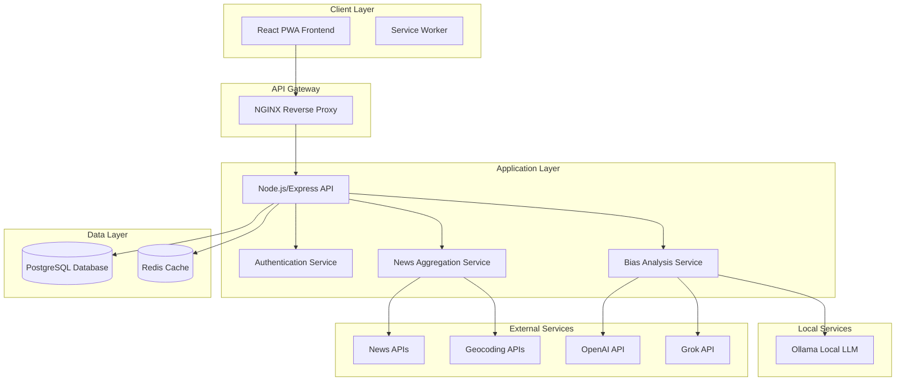

# Design Document

## Overview

The Interactive World News Map is a full-stack progressive web application built with modern web technologies. The system uses a microservices architecture with containerized deployment, featuring a React-based frontend with 3D mapping capabilities, a Node.js/Express backend API, PostgreSQL database for data persistence, and integrated AI services for bias analysis.

## Architecture

### High-Level Architecture



### Technology Stack

**Frontend:**
- React 18 with TypeScript
- Three.js for 3D globe rendering
- Leaflet.js for 2D map visualization
- Material-UI (MUI) for modern UI components
- PWA capabilities with service worker
- Vite for build tooling

**Backend:**
- Node.js with Express.js
- TypeScript for type safety
- JWT for authentication
- Socket.io for real-time updates
- Node-cron for scheduled news fetching

**Database & Caching:**
- PostgreSQL for primary data storage
- Redis for session management and caching
- Database migrations with Knex.js

**Deployment:**
- Docker containers for all services
- Docker Compose for orchestration
- NGINX as reverse proxy and static file server

## Components and Interfaces

### Frontend Components

#### Core Components
- **MapContainer**: Main component managing map/globe toggle and rendering
- **NewsPin**: Interactive markers displaying article previews
- **ArticleModal**: Detailed article view with bias scoring
- **DatePicker**: Historical date selection interface
- **FilterPanel**: Geographic and content filtering controls
- **AuthGuard**: Authentication wrapper component

#### Map Components
- **GlobeView**: Three.js-based 3D globe with country meshes and pin rendering
- **MapView**: Leaflet-based 2D world map with clustering
- **PinCluster**: Grouped pins for dense news areas
- **LocationMarker**: Individual news article markers

#### UI Components
- **BiasIndicator**: Visual bias score display (color-coded meter)
- **LoadingSpinner**: Consistent loading states
- **ErrorBoundary**: Error handling and user feedback
- **NavigationBar**: Main app navigation and user controls

### Backend Services

#### API Endpoints

**Authentication Service**
```typescript
POST /api/auth/login
POST /api/auth/register
POST /api/auth/logout
GET /api/auth/profile
```

**News Service**
```typescript
GET /api/news/articles?date=YYYY-MM-DD&lat=X&lng=Y&radius=Z
GET /api/news/article/:id
POST /api/news/refresh
GET /api/news/sources
```

**User Service**
```typescript
GET /api/user/preferences
PUT /api/user/preferences
GET /api/user/history
```

#### Service Interfaces

**News Aggregation Service**
- Fetches from multiple news APIs (NewsAPI, Guardian, Reuters)
- Extracts location data using NLP and geocoding
- Stores articles with geographic coordinates
- Schedules periodic updates

**Bias Analysis Service**
- Supports multiple LLM providers: OpenAI API, Grok API, and local Ollama models
- Implements provider abstraction layer for consistent bias analysis interface
- Analyzes article content for political lean and factual accuracy
- Generates numerical bias scores (0-100 scale) with standardized methodology
- Includes provider fallback mechanisms and error handling
- Caches analysis results with provider-specific cache keys

**LLM Provider Implementations**
- **OpenAI Provider**: Uses GPT-3.5/GPT-4 models via OpenAI API with structured prompts
- **Grok Provider**: Integrates with Grok API for bias analysis using xAI's models
- **Ollama Provider**: Connects to local Ollama instances supporting models like Llama 2, Mistral, etc.

**LLM Provider Interface**
```typescript
interface LLMProvider {
  name: string;
  analyzeArticle(content: string): Promise<BiasAnalysis>;
  isAvailable(): Promise<boolean>;
  getConfig(): ProviderConfig;
}

interface ProviderConfig {
  apiKey?: string;
  baseUrl?: string;
  model: string;
  timeout: number;
  maxRetries: number;
}
```

## Data Models

### Database Schema

```sql
-- Users table
CREATE TABLE users (
    id SERIAL PRIMARY KEY,
    email VARCHAR(255) UNIQUE NOT NULL,
    password_hash VARCHAR(255) NOT NULL,
    created_at TIMESTAMP DEFAULT CURRENT_TIMESTAMP,
    preferences JSONB DEFAULT '{}'
);

-- Articles table
CREATE TABLE articles (
    id SERIAL PRIMARY KEY,
    title VARCHAR(500) NOT NULL,
    content TEXT,
    summary TEXT,
    url VARCHAR(1000) UNIQUE NOT NULL,
    source VARCHAR(100) NOT NULL,
    published_at TIMESTAMP NOT NULL,
    latitude DECIMAL(10, 8),
    longitude DECIMAL(11, 8),
    location_name VARCHAR(200),
    bias_score INTEGER,
    bias_analysis JSONB,
    created_at TIMESTAMP DEFAULT CURRENT_TIMESTAMP,
    updated_at TIMESTAMP DEFAULT CURRENT_TIMESTAMP
);

-- User sessions table
CREATE TABLE user_sessions (
    id SERIAL PRIMARY KEY,
    user_id INTEGER REFERENCES users(id),
    session_token VARCHAR(255) UNIQUE NOT NULL,
    expires_at TIMESTAMP NOT NULL,
    created_at TIMESTAMP DEFAULT CURRENT_TIMESTAMP
);

-- User article interactions
CREATE TABLE user_interactions (
    id SERIAL PRIMARY KEY,
    user_id INTEGER REFERENCES users(id),
    article_id INTEGER REFERENCES articles(id),
    interaction_type VARCHAR(50), -- 'view', 'bookmark', 'share'
    created_at TIMESTAMP DEFAULT CURRENT_TIMESTAMP
);

-- Indexes for performance
CREATE INDEX idx_articles_location ON articles(latitude, longitude);
CREATE INDEX idx_articles_published_at ON articles(published_at);
CREATE INDEX idx_articles_bias_score ON articles(bias_score);
```

### TypeScript Interfaces

```typescript
interface Article {
  id: number;
  title: string;
  content: string;
  summary: string;
  url: string;
  source: string;
  publishedAt: Date;
  latitude: number;
  longitude: number;
  locationName: string;
  biasScore: number;
  biasAnalysis: BiasAnalysis;
}

interface BiasAnalysis {
  politicalLean: 'left' | 'center' | 'right';
  factualAccuracy: number;
  emotionalTone: number;
  confidence: number;
}

interface User {
  id: number;
  email: string;
  preferences: UserPreferences;
}

interface UserPreferences {
  defaultView: 'map' | 'globe';
  preferredSources: string[];
  biasThreshold: number;
  autoRefresh: boolean;
}
```

## Error Handling

### Frontend Error Handling
- React Error Boundaries for component-level error catching
- Global error handler for API request failures
- User-friendly error messages with retry options
- Offline support with cached data fallback

### Backend Error Handling
- Centralized error middleware for consistent error responses
- Structured error logging with Winston
- Rate limiting to prevent API abuse
- Graceful degradation when external services fail

### Error Response Format
```typescript
interface ErrorResponse {
  error: {
    code: string;
    message: string;
    details?: any;
    timestamp: string;
  };
}
```

## Testing Strategy

### Frontend Testing
- **Unit Tests**: Jest + React Testing Library for component testing
- **Integration Tests**: Testing user workflows and API integration
- **E2E Tests**: Playwright for full application testing
- **Visual Tests**: Storybook for component documentation and visual regression

### Backend Testing
- **Unit Tests**: Jest for service and utility function testing
- **Integration Tests**: Supertest for API endpoint testing
- **Database Tests**: Test database with migrations and seed data
- **Load Tests**: Artillery.js for performance testing

### Test Coverage Goals
- Minimum 80% code coverage for critical paths
- 100% coverage for authentication and security functions
- Performance benchmarks for map rendering and data loading

## Security Considerations

### Authentication & Authorization
- JWT tokens with short expiration times
- Refresh token rotation
- Password hashing with bcrypt
- Rate limiting on authentication endpoints

### Data Protection
- Input validation and sanitization
- SQL injection prevention with parameterized queries
- XSS protection with Content Security Policy
- HTTPS enforcement in production

### API Security
- CORS configuration for allowed origins
- API key management for external services
- Request size limits
- IP-based rate limiting

### LLM Provider Configuration
Environment variables for configuring bias analysis providers:

```bash
# Primary LLM provider selection
BIAS_ANALYSIS_PROVIDER=openai|grok|ollama

# OpenAI Configuration
OPENAI_API_KEY=sk-...
OPENAI_MODEL=gpt-3.5-turbo
OPENAI_BASE_URL=https://api.openai.com/v1

# Grok Configuration  
GROK_API_KEY=grok-...
GROK_MODEL=grok-beta
GROK_BASE_URL=https://api.x.ai/v1

# Ollama Configuration
OLLAMA_BASE_URL=http://localhost:11434
OLLAMA_MODEL=llama2:7b
OLLAMA_TIMEOUT=30000

# Fallback configuration
BIAS_ANALYSIS_FALLBACK_PROVIDERS=openai,ollama
BIAS_ANALYSIS_CACHE_TTL=86400
```

## Performance Optimization

### Frontend Performance
- Code splitting and lazy loading for map components
- Virtual scrolling for large article lists
- Image optimization and lazy loading
- Service worker caching for offline functionality

### Backend Performance
- Database query optimization with proper indexing
- Redis caching for frequently accessed data
- Connection pooling for database connections
- Compression middleware for API responses

### Map Performance
- Level-of-detail (LOD) for 3D globe rendering
- Pin clustering for dense areas
- Viewport-based data loading
- WebGL optimization for smooth interactions